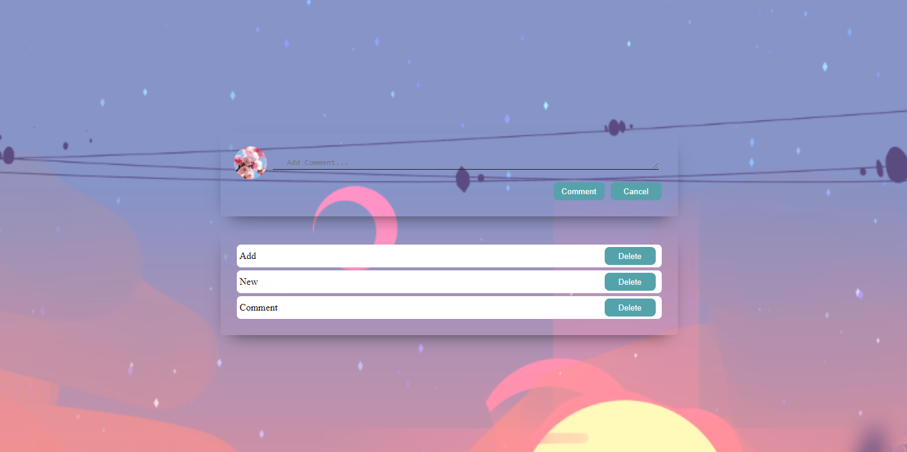

### Comment-section

You can try live demo by clicking on 'github-pages' in Environments ->

Any type of text can be attached to the comment section body.

If any of the buttons is pressed while the field is empty nothing happens.

Every comment comes with a delete button.

~Last update: 26.04.2023
